The following communications were sent publicly to my App Academy classmates over the course of the program.

# Better Flask errors for a JSON API
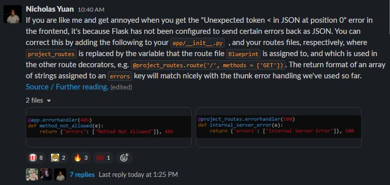

# Fixing an N+1 Selects problem in SQLAlchemy
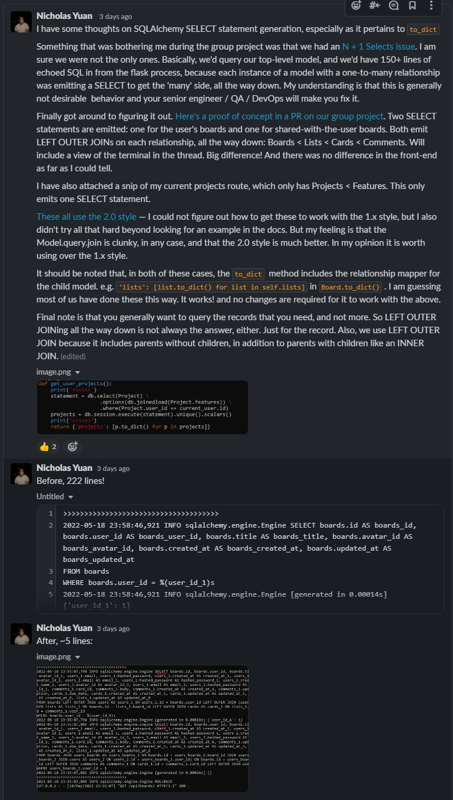

# Things to watch out for in the implementation of S3 presigned link uploads in Flask, with footnotes, after assisting several classmates
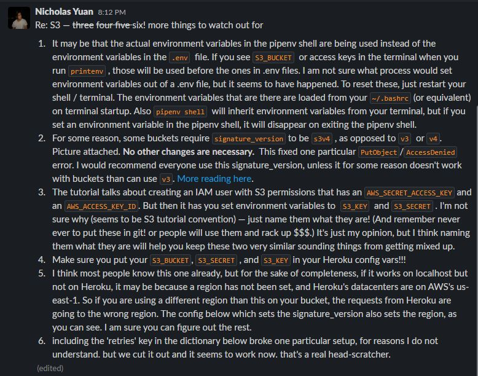
Footnotes follow:
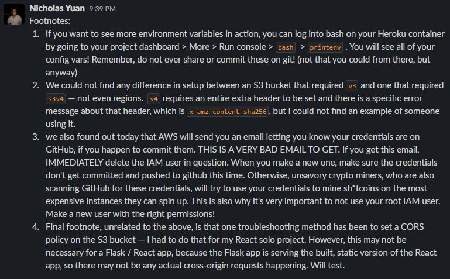

# A heads-up on Enums in Flask
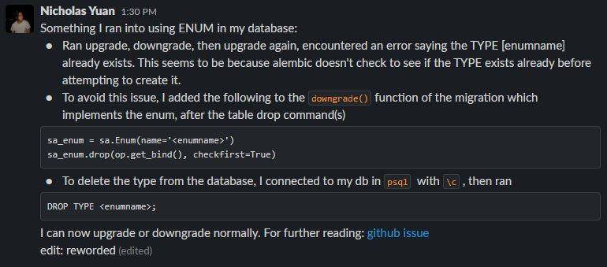

# Fixing a toggle in a Pokedex app
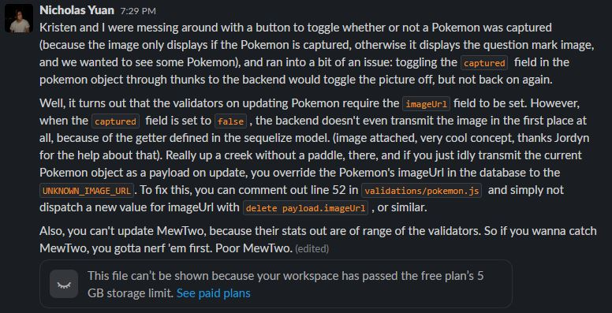

# Chai and deep equality
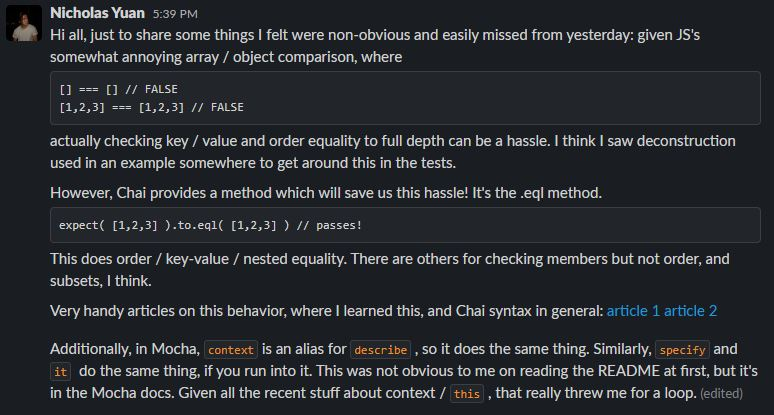

# try-catch fetch anti-pattern
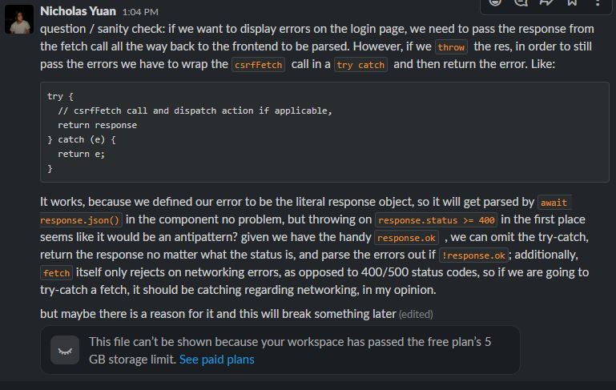

# The use of Number vs parseInt in Javascript
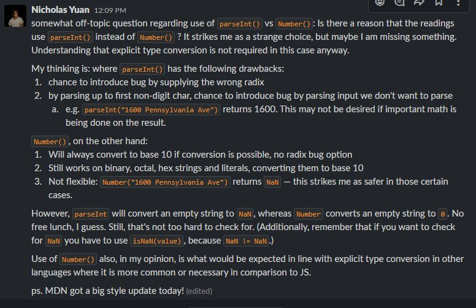

# on next seeders in Sequelize

# on a very curious bug in a React / Flask application
This is an interesting one. I was mistaken about `@login_required` setting the value of `current_user`, for one thing. This issue ended up being caused by a trailing `/` in the front-end `fetch` call. I spent several hours on this, and the fix was eventually suggested by the instructor of the python module. This was one of those brutal, brutal bugs.

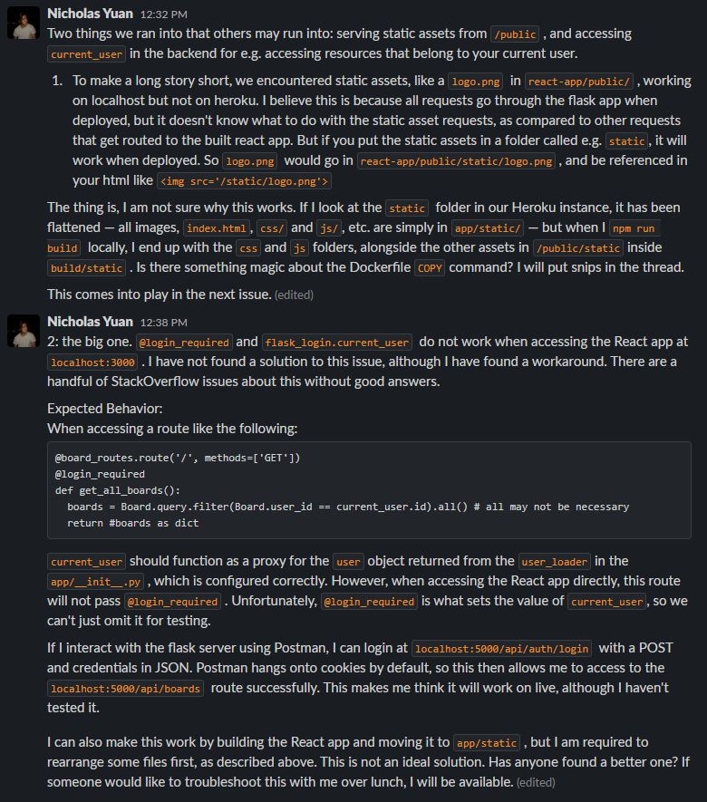

# On async hashing:
While being mindful that the original author may also be in the Slack Channel, I was curious about the decision to use synchronous hashing.

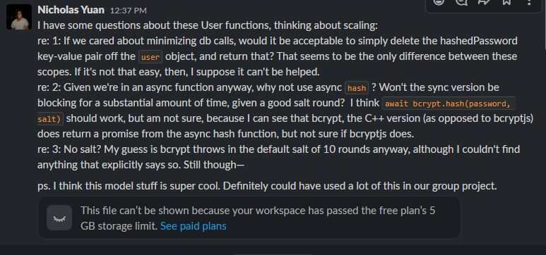
